# Kineo – Refactoring Architetturale da Monolite a Microservizi

## Descrizione del Progetto

Kineo è una piattaforma e-learning pensata per supportare l'apprendimento delle lingue attraverso contenuti video interattivi.

Gli utenti possono guardare video suddivisi per livello di difficoltà, seguire sottotitoli sincronizzati durante la riproduzione, consultare il significato di parole ed espressioni incontrate nei contenuti e salvarle nel proprio dizionario personale.

L'obiettivo della piattaforma è favorire un apprendimento più naturale e contestualizzato della lingua, permettendo allo studente di ampliare il proprio vocabolario e monitorare i termini appresi direttamente durante la visione dei video.

Il progetto nasce come applicazione monolitica composta da un unico backend e da un frontend centralizzato. Nell'ambito del corso di Evoluzione del Software, il sistema è stato progressivamente trasformato in un'architettura distribuita basata su microservizi e microfrontend, con l'obiettivo di migliorarne scalabilità, manutenibilità ed evoluzione futura.

La piattaforma distingue due tipologie di utenti:

- Studenti, che utilizzano i contenuti didattici e gli strumenti di supporto allo studio.
- Amministratori, che gestiscono utenti, catalogo e moderazione della piattaforma.

---

## Obiettivi del Refactoring

La migrazione architetturale è stata realizzata perseguendo i seguenti obiettivi:

- Suddivisione delle responsabilità applicative in servizi indipendenti.
- Riduzione dell'accoppiamento tra i moduli software.
- Miglioramento della scalabilità del sistema.
- Introduzione di un API Gateway per la gestione centralizzata delle richieste.
- Introduzione di comunicazioni asincrone tra servizi.
- Introduzione di microfrontend per l'isolamento delle funzionalità lato client.
- Miglioramento della manutenibilità complessiva del progetto.

---

## Evoluzione Architetturale

Il progetto Kineo è nato come applicazione monolitica composta da un unico backend e da un frontend centralizzato.

Durante il corso di Evoluzione del Software il sistema è stato progressivamente trasformato seguendo il pattern Strangler, consentendo una migrazione incrementale verso un'architettura distribuita senza interrompere il funzionamento dell'applicazione.

L'evoluzione ha introdotto:

- Kong come API Gateway centrale.
- Microservizi indipendenti per i diversi domini applicativi.
- RabbitMQ per la comunicazione asincrona tra servizi.
- Database separati per ciascun dominio applicativo.
- Microfrontend basati su Next.js Multi-Zones.
- Containerizzazione tramite Docker e Docker Compose.

Kineo rappresenta un caso di studio di evoluzione architetturale da sistema monolitico a piattaforma distribuita basata su microservizi e microfrontend.

Il progetto ha permesso di applicare concretamente concetti fondamentali dell'ingegneria del software moderna, tra cui:

- Strangler Pattern
- API Gateway
- Comunicazione asincrona
- Database-per-Service
- Containerizzazione
- Separazione delle responsabilità

L'architettura risultante permette una maggiore modularità, una migliore manutenibilità e una più semplice evoluzione futura del sistema.

---

## Tecnologie Utilizzate

### Frontend

- Next.js
- React
- JavaScript
- CSS

### Backend

- Node.js
- Express.js

### Database

- MongoDB Atlas
- Mongoose

### Infrastruttura

- Docker
- Docker Compose
- Kong API Gateway
- RabbitMQ
- Redis

### Versionamento

- Git
- GitHub

---

## Architettura del Sistema

L'architettura finale del progetto è composta da tre frontend Next.js, un API Gateway centrale, cinque microservizi indipendenti, una componente di comunicazione asincrona tramite RabbitMQ, un sistema di cache Redis e database separati ospitati su MongoDB Atlas.

### 5.1 Diagramma Architetturale

```mermaid
flowchart LR

User["Utente / Browser"]

subgraph Frontend["Host locale - Frontend Next.js"]
    ClientNext["client-next<br/>Shell principale<br/>Porta 3000<br/>Login / Register / Dashboard / Dizionario"]
    ClientAdmin["client-admin<br/>Microfrontend Admin<br/>Porta 3001<br/>Gestione utenti / video / commenti"]
    ClientCatalogo["client-catalogo<br/>Microfrontend Catalogo<br/>Porta 3002<br/>Catalogo / Player / Commenti / Dizionario"]
end

subgraph DockerNet["Docker Compose Network: kineo_net"]
    Kong["kineo_gateway<br/>Kong API Gateway<br/>Porte 8000 <br/>HTTP REST + JWT"]

    subgraph Backend["Backend Microservices"]
        Auth["kineo_auth<br/>microservice-auth<br/>Porta interna 5005<br/>Login / Register / JWT"]
        UserMS["kineo_user<br/>microservice-user<br/>Porta interna 5007<br/>Profili utenti"]
        CatalogoMS["kineo_catalogo<br/>microservice-catalogo<br/>Porta interna 5003<br/>Video / Sottotitoli"]
        CommentiMS["kineo_commenti<br/>microservice-commenti<br/>Porta interna 5006<br/>Commenti / Like / Risposte"]
        DizionarioMS["kineo_dizionario<br/>microservice-dizionario<br/>Porta interna 5002<br/>Traduzioni / Parole salvate"]
    end

    RabbitMQ["rabbitmq<br/>RabbitMQ Broker<br/>5672 AMQP<br/>15672 Management UI"]
    Redis["kineo_cache<br/>Redis Cache<br/>6379 TCP"]
end

subgraph Atlas["MongoDB Atlas Cloud"]
    AuthDB[("kineo_auth_db<br/>Credenziali / Ruoli")]
    UserDB[("kineo_user_db<br/>Profili utenti")]
    CatalogoDB[("kineo_catalogo<br/>Video / Metadata / Sottotitoli")]
    CommentiDB[("kineo_commenti<br/>Commenti / Like / Risposte")]
    DizionarioDB[("kineo_dizionario<br/>Dizionario / Parole salvate")]
end

User -->|"HTTP<br/>localhost:3000"| ClientNext

ClientNext -->|"Next.js Multi-Zone Rewrite<br/>/admin → localhost:3001"| ClientAdmin
ClientNext -->|"Next.js Multi-Zone Rewrite<br/>/catalogo → localhost:3002"| ClientCatalogo

ClientNext -->|"HTTP REST<br/>public + JWT protected<br/>localhost:8000"| Kong
ClientAdmin -->|"HTTP REST + JWT<br/>localhost:8000"| Kong
ClientCatalogo -->|"HTTP REST<br/>public + JWT protected<br/>localhost:8000"| Kong

Kong -->|"/api/login<br/>/api/register<br/>pubbliche"| Auth
Kong -->|"/api/user/*<br/>JWT protected"| UserMS
Kong -->|"/api/videos/*<br/>GET pubbliche<br/>POST/PATCH/DELETE protette"| CatalogoMS
Kong -->|"/api/commenti/*<br/>JWT protected"| CommentiMS
Kong -->|"/api/translate pubblica<br/>/api/user/:id/dizionario protetta"| DizionarioMS

Auth -->|"HTTP interno<br/>POST /api/user/init<br/>creazione profilo"| UserMS
Auth -->|"HTTP interno<br/>GET /api/user/:id<br/>dati profilo al login"| UserMS

CommentiMS -->|"HTTP interno<br/>GET /api/user/:id<br/>API Composition autore commento"| UserMS
CommentiMS -->|"HTTP interno<br/>GET /api/videos/:id<br/>API Composition titolo video"| CatalogoMS

CommentiMS -->|"TCP / Redis protocol<br/>cache profili utente<br/>TTL 3600s"| Redis

UserMS -->|"AMQP<br/>pubblica user.deleted"| RabbitMQ
CatalogoMS -->|"AMQP<br/>pubblica video.deleted"| RabbitMQ

RabbitMQ -->|"AMQP<br/>user.deleted<br/>cancella commenti utente"| CommentiMS
RabbitMQ -->|"AMQP<br/>video.deleted<br/>cancella commenti video"| CommentiMS
RabbitMQ -->|"AMQP<br/>user.deleted<br/>cancella parole salvate"| DizionarioMS

Auth -->|"Mongoose / MongoDB Driver<br/>TLS verso Atlas"| AuthDB
UserMS -->|"Mongoose / MongoDB Driver<br/>TLS verso Atlas"| UserDB
CatalogoMS -->|"Mongoose / MongoDB Driver<br/>TLS verso Atlas"| CatalogoDB
CommentiMS -->|"Mongoose / MongoDB Driver<br/>TLS verso Atlas"| CommentiDB
DizionarioMS -->|"Mongoose / MongoDB Driver<br/>TLS verso Atlas"| DizionarioDB

classDef frontend fill:#e3f2fd,stroke:#1565c0,stroke-width:2px,color:#000;
classDef gateway fill:#fff3e0,stroke:#ef6c00,stroke-width:2px,color:#000;
classDef backend fill:#e8f5e9,stroke:#2e7d32,stroke-width:2px,color:#000;
classDef broker fill:#f3e5f5,stroke:#6a1b9a,stroke-width:2px,color:#000;
classDef database fill:#fce4ec,stroke:#ad1457,stroke-width:2px,color:#000;
classDef user fill:#eeeeee,stroke:#424242,stroke-width:2px,color:#000;

class ClientNext,ClientAdmin,ClientCatalogo frontend;
class Kong gateway;
class Auth,UserMS,CatalogoMS,CommentiMS,DizionarioMS backend;
class RabbitMQ,Redis broker;
class AuthDB,UserDB,CatalogoDB,CommentiDB,DizionarioDB database;
class User user;
```




---

### 5.2 Componenti Funzionali

#### client-next

Frontend principale dell'applicazione.

Gestisce:

- Login
- Registrazione
- Dashboard utente
- Profilo personale
- Dizionario personale

Funziona inoltre come shell principale per l'instradamento verso i microfrontend tramite Next.js Multi-Zones.

#### client-admin

Microfrontend dedicato all'area amministrativa.

Permette agli amministratori di:

- Gestire utenti
- Gestire catalogo video
- Moderare commenti

#### client-catalogo

Microfrontend dedicato alla fruizione dei contenuti video.

Gestisce:

- Catalogo video
- Player video
- Sottotitoli sincronizzati
- Commenti
- Interazioni didattiche

#### Kong API Gateway

Componente centrale di accesso alle API.

Riceve le richieste provenienti dai frontend sulla porta 8000 e le instrada verso il microservizio corretto.

#### microservice-auth

Responsabile di:

- Registrazione utenti
- Login
- Gestione ruoli
- Generazione JWT

#### microservice-user

Responsabile di:

- Profili utente
- Informazioni personali
- Gestione account

#### microservice-catalogo

Responsabile di:

- Video
- Livelli linguistici
- Metadati
- Sottotitoli sincronizzati

#### microservice-commenti

Responsabile di:

- Commenti
- Risposte
- Like
- Moderazione

Utilizza API Composition per recuperare dati da altri servizi quando deve mostrare informazioni complete al frontend.

#### microservice-dizionario

Responsabile di:

- Traduzioni
- Parole salvate
- Dizionario personale

#### RabbitMQ

Message broker utilizzato per la comunicazione asincrona tra microservizi.

Permette di propagare eventi come:

- Eliminazione utenti
- Eliminazione video

senza creare dipendenze dirette tra servizi.

#### Redis

Sistema di cache utilizzato principalmente dal servizio commenti per ridurre chiamate ripetute verso altri microservizi.

#### MongoDB Atlas

Piattaforma cloud utilizzata per la persistenza dei dati.

Ogni microservizio possiede un database dedicato secondo il pattern Database-per-Service.

---

### 5.3 Decisioni Architetturali

#### Migrazione incrementale tramite Strangler Pattern

Il sistema originale è stato evoluto progressivamente da monolite a microservizi evitando una riscrittura completa dell'applicazione.

Le funzionalità sono state estratte gradualmente e migrate in servizi indipendenti.

#### Separazione delle responsabilità tramite microservizi

Ogni microservizio gestisce un dominio specifico:

- Autenticazione
- Utenti
- Catalogo
- Commenti
- Dizionario

Questa separazione riduce l'accoppiamento e migliora la manutenibilità.

#### API Gateway centralizzato

Kong funge da punto unico di ingresso verso il backend.

I frontend non comunicano direttamente con i singoli microservizi ma inviano le richieste al gateway che si occupa del routing.

#### Database-per-Service

Ogni microservizio possiede un database dedicato su MongoDB Atlas.

Questa scelta evita l'accesso diretto ai dati di altri servizi e rafforza l'indipendenza dei domini applicativi.

#### API Composition

Alcune informazioni richiedono l'aggregazione di dati provenienti da più microservizi.

Ad esempio il servizio commenti recupera informazioni sugli utenti e sui video senza accedere direttamente ai rispettivi database.

#### Comunicazione asincrona tramite RabbitMQ

RabbitMQ viene utilizzato per propagare eventi tra servizi.

Quando un utente o un video viene eliminato, i servizi interessati ricevono l'evento e aggiornano autonomamente i propri dati.

#### Caching tramite Redis

Redis riduce il numero di chiamate ripetute tra microservizi, migliorando le prestazioni complessive del sistema.

#### Microfrontend tramite Next.js Multi-Zones

Il frontend è stato suddiviso in:

- client-next
- client-admin
- client-catalogo

L'utente percepisce un'unica applicazione mentre internamente alcune sezioni sono servite da frontend indipendenti.

#### Containerizzazione del backend

I microservizi backend, Kong, RabbitMQ e Redis vengono eseguiti tramite Docker Compose all'interno di una rete dedicata.

I frontend vengono invece eseguiti localmente tramite `npm run dev` per facilitare sviluppo e debugging.

---

### 5.4 Comunicazione tra i Servizi

La comunicazione all'interno dell'architettura Kineo avviene attraverso diversi meccanismi.

- I frontend comunicano esclusivamente con Kong API Gateway.
- Kong instrada ogni richiesta verso il microservizio corretto.
- Alcuni microservizi utilizzano API Composition per recuperare informazioni appartenenti ad altri domini applicativi.
- RabbitMQ gestisce la propagazione asincrona degli eventi.
- Redis viene utilizzato come sistema di cache per ridurre le chiamate ripetute tra servizi.

---

## 6. Tipologie di Utenti

### Studente

Lo studente rappresenta l'utilizzatore principale della piattaforma.

Può:

- Registrarsi ed effettuare il login.
- Consultare il catalogo video.
- Visualizzare sottotitoli sincronizzati.
- Utilizzare il dizionario personale.
- Salvare parole e traduzioni.
- Inserire commenti sui contenuti didattici.
- Gestire il proprio profilo personale.

### Amministratore

L'amministratore è responsabile della gestione operativa della piattaforma.

Può:

- Gestire gli utenti registrati.
- Gestire il catalogo video.
- Moderare commenti e contenuti.
- Accedere alla dashboard amministrativa dedicata.

---

## 7. Funzionalità Principali

### Autenticazione e Registrazione

**Responsabile:**

- microservice-auth

**Funzionalità:**

- Registrazione utenti
- Login
- Gestione JWT
- Gestione ruoli

---

### Gestione Profilo Utente

**Responsabile:**

- microservice-user

**Funzionalità:**

- Visualizzazione profilo
- Aggiornamento informazioni personali
- Gestione dati utente

---

### Catalogo Video

**Responsabili:**

- client-catalogo
- microservice-catalogo

**Funzionalità:**

- Visualizzazione catalogo
- Filtraggio per livelli linguistici
- Riproduzione video
- Gestione sottotitoli sincronizzati
- Consultazione contenuti didattici

---

### Sistema Commenti

**Responsabili:**

- client-catalogo
- microservice-commenti

**Funzionalità:**

- Inserimento commenti
- Risposte ai commenti
- Like ai commenti
- Moderazione amministrativa

---

### Dizionario Personale

**Responsabili:**

- client-next
- microservice-dizionario

**Funzionalità:**

- Traduzione parole
- Salvataggio vocaboli
- Gestione dizionario personale
- Supporto allo studio durante la visione dei video

---

### Dashboard Amministrativa

**Responsabili:**

- client-admin
- microservice-user
- microservice-commenti
- microservice-catalogo

**Funzionalità:**

- Gestione utenti
- Gestione catalogo video
- Gestione commenti
- Moderazione della piattaforma

---

## 8. Struttura del Progetto

```text
KINEO-TEST-API-GATEWAY
│
├── client-next
│   └── Frontend principale (Shell)
│
├── client-admin
│   └── Microfrontend amministrativo
│
├── client-catalogo
│   └── Microfrontend catalogo video
│
├── microservice-auth
│   └── Autenticazione e registrazione
│
├── microservice-user
│   └── Gestione utenti
│
├── microservice-catalogo
│   └── Gestione catalogo video
│
├── microservice-commenti
│   └── Gestione commenti
│
├── microservice-dizionario
│   └── Gestione dizionario personale
│
├── kong.yml
│   └── Configurazione API Gateway
│
├── docker-compose.yml
│   └── Orchestrazione dei servizi
│
└── README.md
```

---

## 9. Versioni Utilizzate

| Tecnologia | Versione Utilizzata |
|------------|-------------------|
| Node.js | 24.13.0 |
| npm | 11.6.2 |
| Next.js | 16.1.6 |
| React | 19.2.3 |
| Docker | 29.4.0 |
| Docker Compose | 5.1.1 |
| Kong | 3.6.1 |
| RabbitMQ | 3.x Management |
| Redis | 8.8.0 |
| MongoDB Atlas | Cloud |
| Express | 5.2.1 |
| Mongoose | 9.6.3 (Auth, Commenti, Dizionario) / 8.24.0 (User, Catalogo) |

---

## 10. Installazione e Avvio Locale

### Prerequisiti

Installare:

- Git
- Node.js
- Docker Desktop

Assicurarsi che Docker Desktop sia in esecuzione.

---

### Clonazione del Repository

```bash
git clone <repository-url>
cd KINEO-TEST-API-GATEWAY
```

---

### Avvio dell'Infrastruttura Backend

Dalla cartella principale del progetto:

```bash
docker compose up --build
```

Questo comando avvia:

- Kong Gateway
- RabbitMQ
- Redis
- Tutti i microservizi backend

---

### Avvio dei Frontend

Aprire tre terminali separati.

#### Frontend principale

```bash
cd client-next
npm install
npm run dev
```

#### Dashboard amministrativa

```bash
cd client-admin
npm install
npm run dev
```

#### Catalogo video

```bash
cd client-catalogo
npm install
npm run dev
```

---

## 11. Come Iniziare

### 11.1 Accesso Studente

1. Aprire il browser e visitare:

```text
http://localhost:3000
```

2. Registrare un nuovo account oppure effettuare il login.
3. Accedere al catalogo video.
4. Selezionare un contenuto didattico.
5. Utilizzare il dizionario integrato per salvare parole e traduzioni.
6. Gestire il proprio profilo personale.

---

### 11.2 Accesso Amministratore

Utilizzare un account amministratore esistente.

**Email:** admin@kineo.com

**Password:** adminKineo2026

Dopo il login sarà possibile accedere alla dashboard amministrativa e gestire utenti, contenuti e commenti della piattaforma.


